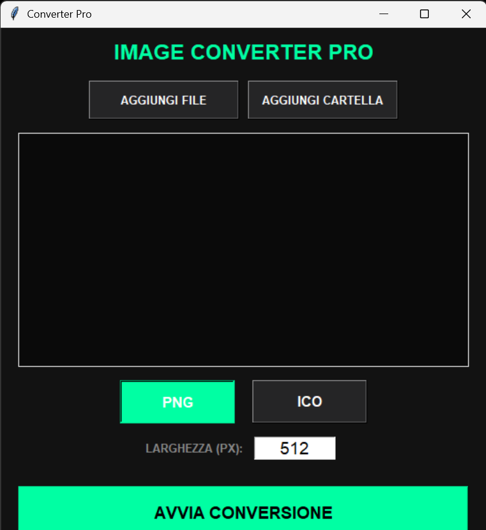

# 🟢 Converter Pro (SVG to PNG/ICO)

Un'applicazione leggera e potente in Python per convertire file SVG in PNG o ICO (icone Windows) mantenendo la massima fedeltà grafica grazie all'integrazione con **Inkscape**.

## ✨ Funzionalità
- **Conversione Batch**: Aggiungi singoli file o intere cartelle.
- **Formati Supportati**: Esporta in PNG ad alta risoluzione o ICO multi-formato.
- **Interfaccia Dark**: Design moderno ottimizzato per un'alta leggibilità.
- **Workflow Rapido**: Chiede automaticamente se vuoi aprire la cartella di destinazione a fine lavoro.

## 🚀 Come usarlo
1. Scarica l'eseguibile dall'area [Releases](https://github.com/ilnanny75/ConverterPro/releases).
2. Avvia ConverterPro.exe.
3. Seleziona i tuoi file SVG, scegli la dimensione e il formato, e clicca su **Avvia**.

## 🛠️ Requisiti di Sistema
Per il corretto funzionamento, assicurati di avere installato:
- [Inkscape](https://inkscape.org/) (necessario per il rendering SVG)
- [ImageMagick](https://imagemagick.org/) (necessario solo per la generazione dei file .ico)

## ⚖️ Licenza
Distribuito sotto licenza MIT. Vedi il file LICENSE per maggiori dettagli.
